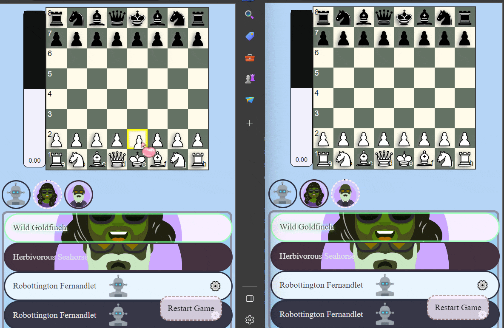
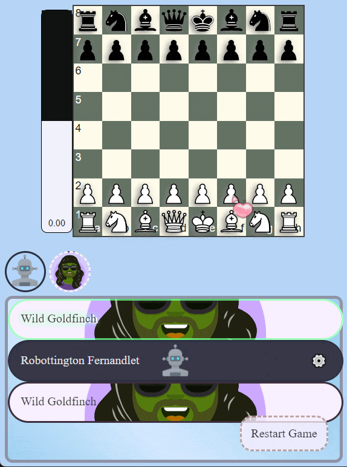

# Stockfish Multiplayer Mania?
This is a Multiplayer(more than just two if you want) chess web app. It is hosted on Heroku and can be accessed [here](https://stockfish-multiplayer-mania-77e15b8ec826.herokuapp.com/). It allows the player to host a room and invite others to join. They can also add as many stockfish bots as they want to either team.

# [Play Now! Hosted on Heroku.](https://stockfish-multiplayer-mania-77e15b8ec826.herokuapp.com/)

## Preview
### 1 player + 1 bot vs 1 player + 1 bot

### 1 player double moving vs 1 bot

## Contributing
Feel free to submit a pull request or an issue. I will try to respond as soon as possible.
